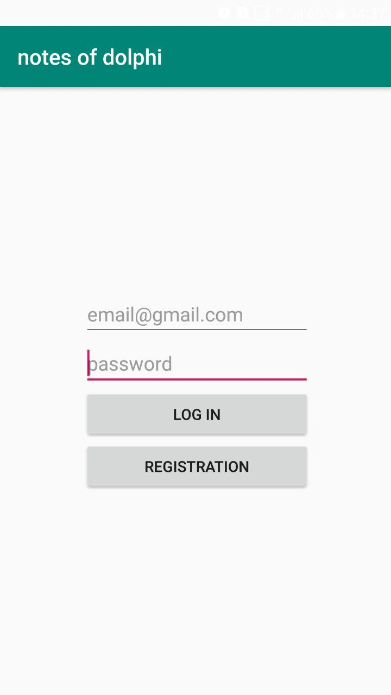
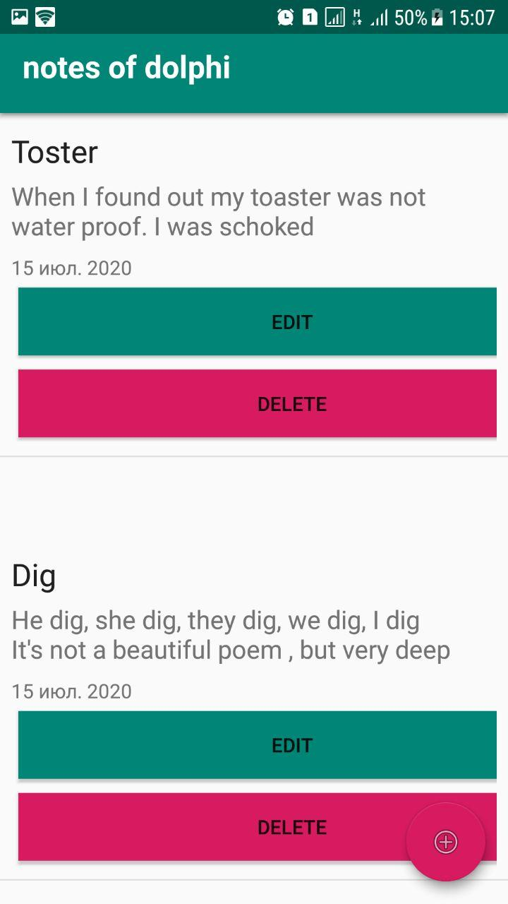
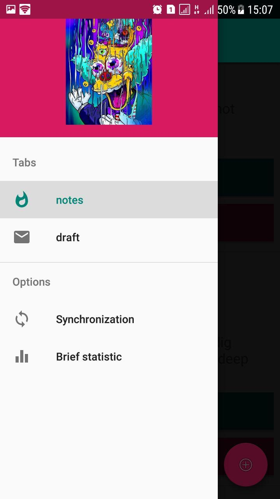

# notes_of_dolphi

<h2>Android client part</h2>
 Simple diary.
<h2>Frameworks and tools</h2>

<h6>
    Java&IDE: JDK8, Android studio 
    Database: sql lite  
    Build Tool: Gradle 
    Linux： Arch Linux 
    Other: --- 
</h6>

<h2>System Features</h2>

<h6>
    <ul>
        <li>Offline mode</li>
        <li>Online mode</li>
        <li>Synchronization of deleted notes</li>
        <li>Totally synchronization</li>
        <li>Ability get brief statistic about application</li>
   </ul>

</h6>

<h2>Screenshots</h2>
<kbd></kbd>
<kbd></kbd>
<kbd></kbd>

