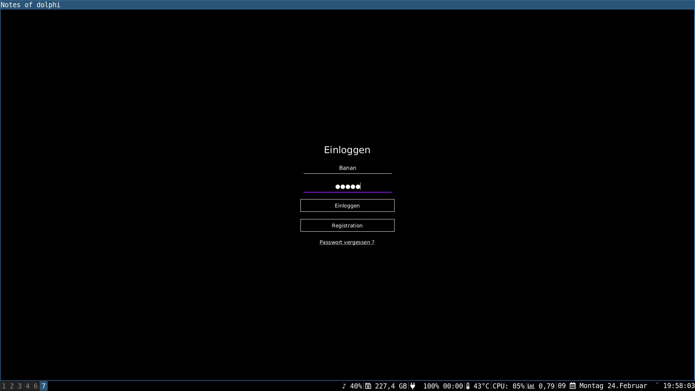
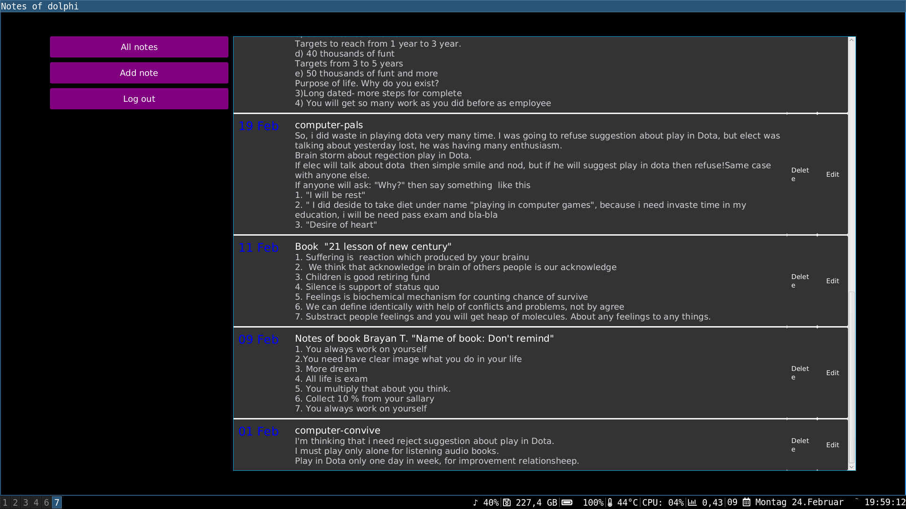
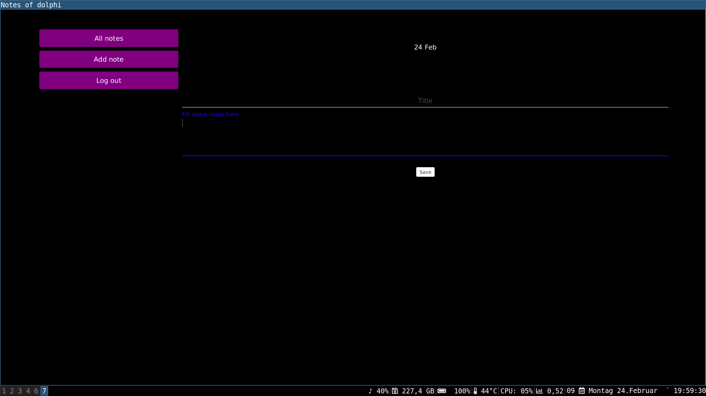

# notes_of_dolphi

<h2>Desktop client part</h2>
 Simple diary.
<h2>Frameworks and tools</h2>

<h6>
    Java&IDE: JDK8 Eclipse 
    Database: sql lite  
    Build Tool: maven 
    Linux： Arch Linux 
    Other: --- 
</h6>

<h2>System Features</h2>

<h6>
    <ul>
        <li>Online mode</li>
        <li>CRUD operations</li>
   </ul>

</h6>

<h2>Tuning project...</h2>

<h6>
    <ul>
     <li>Start application: 
     
     mvn -offline install; java -cp target/Notebook-0.0.1-SNAPSHOT-jar-with-dependencies.jar notes.of.dolphi.Main

   </li>   
   </ul>
</h6>

<h2>Screenshots</h2>
<kbd></kbd>
<kbd></kbd>
<kbd></kbd>

